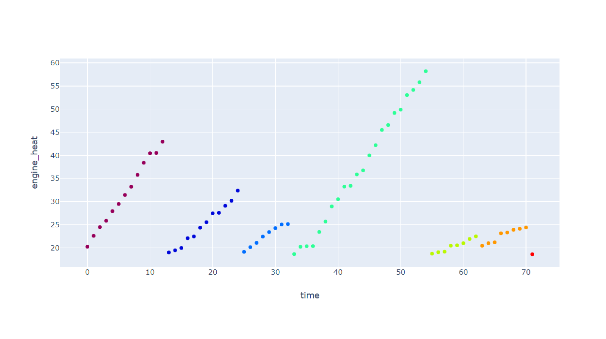

# Clustering time series data with SQL



## Description
Clustering time series data with SQL. The purpose is to prove that doing data science doesn't always require fancy tools.

Examples in this repository might be helpful, if you must use `SQL` instead of proper data science tools such as `python`. Thus this repository is not a comprehensive guide for time series data clustering.

Even though clustering is often connected to machine learning, this showcase relies only on logical decision making.

I have focused on IoT related data in the field of predictive maintenance.

## Files
**sql-clustering.ipynb**
The analysis notebook. You find the notebook fully rendered [here](https://nbviewer.jupyter.org/github/mikaelahonen/sql-clustering/blob/master/sql-clustering.html).

**module.py**
The  contains the functions to generate and plot the sample data.

**config.py**
Settings and variables for the calculations.

## Creating a temporary database in-memory
The experimentation required a temporary database. The first options were either a local `sqlite` database or a managed database service in cloud.

I chose the `sqlite3` library in python and created an sqlite databse on my computer disk. Once I read the documentation further, it seemed possible to create the `sqlite` db to memory.

That approach was perfect for a temporary database:
```py
import sqlite3
con = sqlite3.connect(":memory:")
```
## Choice of visualization library
Standard python data visualization `matplotlib` is known a nice library for static plots.

For this kind of tutorials interactive plots are more instructive in my opinion. A user can hover the mouse all over and receive additional information.

After some investigation I ended up using `plotly`. The implementation is effortless and it has great documentation.

An interesting finding was the `dash` library based from `plotly`. `dash` is a dashboarding framework for advanced graphing.

## Rendering notebooks online
GitHub should be able to render python notebooks in the web browser. Unfortunately some libraries that I used broke the rendering.

Then I tried [nbviewer from Jupyter](https://nbviewer.jupyter.org) which didn't show the `plotly` charts properly. Finally saving the notebook as an `html` file and viewing through nbviewer solved the issue.
